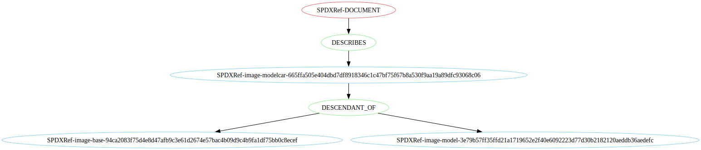

# Modelcar SBOM

The Mobster tool is capable of generating SBOMs for modelcar based
on the guidelines from the
[Red Hat Product Security](https://github.com/RedHatProductSecurity/security-data-guidelines).

## Usage

```bash
mobster generate \
    --output index.sbom.spdx.json \
    modelcar \
    --modelcar-image quay.io/example/modelcar:v22@sha256:cc6016b62f25d56507033c48b04517ba40b3490b1e9b01f1c485371311ed42c4 \
    --base-image quay.io/example/base:9.0@sha256:96fbb4c227d543011dfff0679a89ce664d1a009654858f2df28be504bc1863c1 \
    --model-image quay.io/example/model:v1@sha256:087dc7896b97911a582702b45ff1d41ffa3e142d0b000b0fbb11058188293cfc \
    --sbom-type spdx
```


**List of arguments:**

- `---modelcar-image`
  - Modelcar image pullspec with digest (optional tag) `repository/image:tag@sha256:hexvalue`
  - Example value `quay.io/example/modelcar:v22@sha256:cc6016b62f25d56507033c48b04517ba40b3490b1e9b01f1c485371311ed42c4`
- `--base-image`
  - Modelcar base image pullspec with digest (optional tag) `repository/image:tag@sha256:hexvalue`
  - Example value `quay.io/example/modelcar:v22@sha256:cc6016b62f25d56507033c48b04517ba40b3490b1e9b01f1c485371311ed42c4`
- `--model-image`
  - Model image pullspec with digest (optional tag) `repository/image:tag@sha256:hexvalue`
  - Example value `quay.io/example/modelcar:v22@sha256:cc6016b62f25d56507033c48b04517ba40b3490b1e9b01f1c485371311ed42c4`
- `--output`
  - Path where the SBOM should be written
- ` --sbom-type`
  - Type of SBOM to generate (`spdx` or `cyclonedx`)


## Example

The example SBOM generated by the above command is available in:
- [tests/data/modelcar_sbom.spdx.json](https://github.com/konflux-ci/mobster/blob/main/tests/data/modelcar_sbom.spdx.json).
- [tests/data/modelcar_sbom.cyclonedx.json](https://github.com/konflux-ci/mobster/blob/main/tests/data/modelcar_sbom.cyclonedx.json).

# Structure of the generated SBOM

The generated SBOM has following structure:
```
 - SPDXRef-DOCUMENT
    - SPDXRef-modelcar-image
        - Base image (DESCENDANT_OF)
        - Model image (DESCENDANT_OF)
```

The Cyclonedx SBOM has the equivalent structure:
```
 - modelcar-image
    - base-image
    - model-image
```


