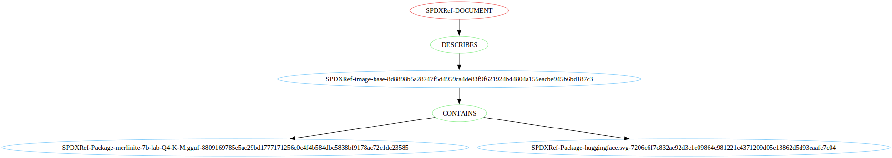

# SBOM for oci artifact

The Mobster tool is capable of generating SBOMs for OCI artifact that contains
an content generated by the
[oci-copy](https://github.com/konflux-ci/build-definitions/tree/main/task/oci-copy/0.2)
tekton task.

## Usage

```bash
# Using an example oci-copy.yaml file generate the SBOM for the OCI artifact
mobster generate \
    generate  \
    --output oci-copy.spdx.json \
    oci-artifact \
    --oci-copy-yaml sample-oci-copy.yaml \
    --image-pullspec quay.io/example/base:v1 \
    --image-digest sha256:087dc7896b97911a582702b45ff1d41ffa3e142d0b000b0fbb11058188293cfc \
    --sbom-type spdx

```


**List of arguments:**

- `--image-pullspec IMAGE_PULLSPEC`
  - Image pullspec for the OCI image in the format <registry>/<repository>:<tag>
- `--image-digest IMAGE_DIGEST`
  - Image digest for the OCI image in the format sha256:<digest>
- `--oci-copy-yaml OCI_COPY_YAML`
  - Path to the OCI copy YAML file
  - The file needs to follow the oci-copy [schema](https://github.com/konflux-ci/build-definitions/blob/main/task/oci-copy/0.1/README.md#oci-copyyaml-schema)
  - Test example file is available at [tests/data/sample-oci-copy.yaml](../../tests/data/oci_copy_example.yaml)
- `--sbom-type {cyclonedx,spdx}`
  - Type of SBOM to generate (default: cyclonedx)

## Example

The example SBOM generated by the above command is available in
- [tests/data/oci_artifact_sbom.spdx.json](../../tests/data/oci_artifact_sbom.spdx.json).
- [tests/data/oci_artifact_sbom.cyclonedx.json](../../tests/data/oci_artifact_sbom.cyclonedx.json).

# Structure of the generated SBOM

The generated SBOM has following structure:
```
 - SPDXRef-DOCUMENT
    - SPDXRef-oci-artifact-image
        - example-artifact-file.txt (CONTAINS)
        - example-aimodel.gguf (CONTAINS)
        - example-readme.md (CONTAINS)
```


